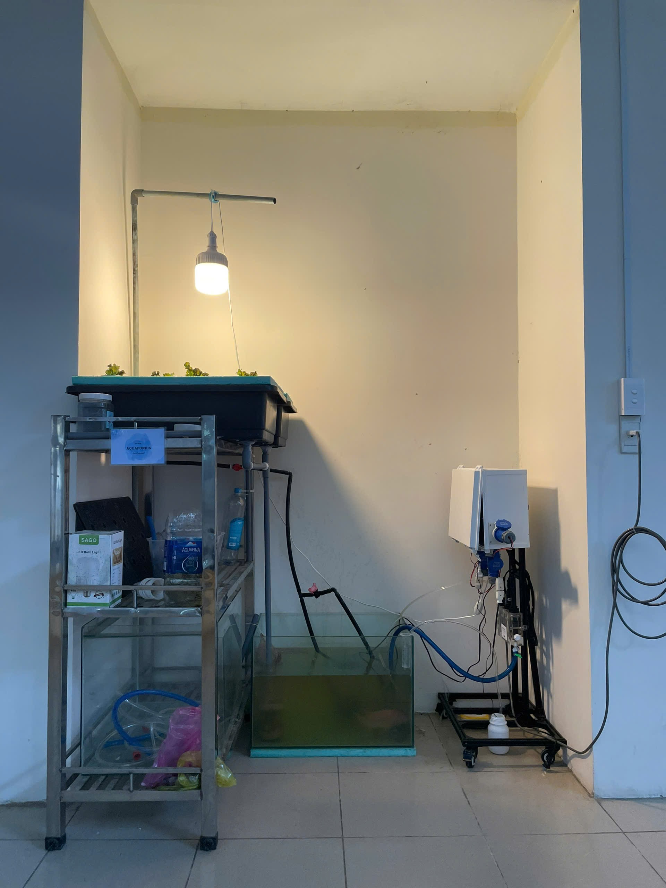
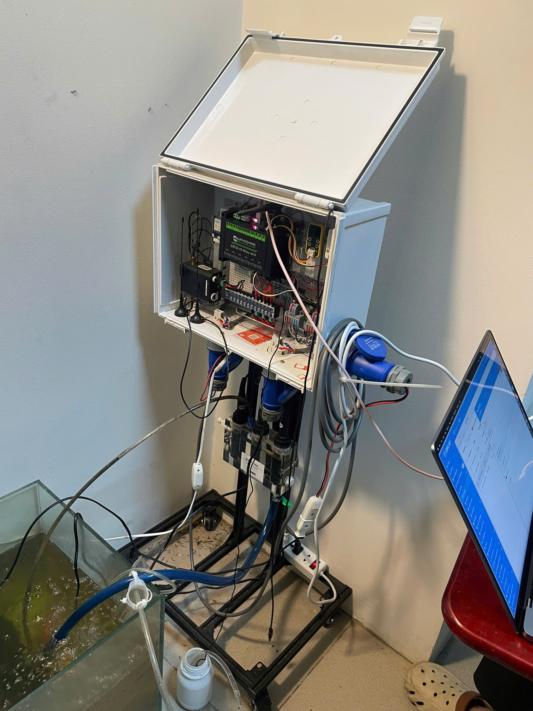
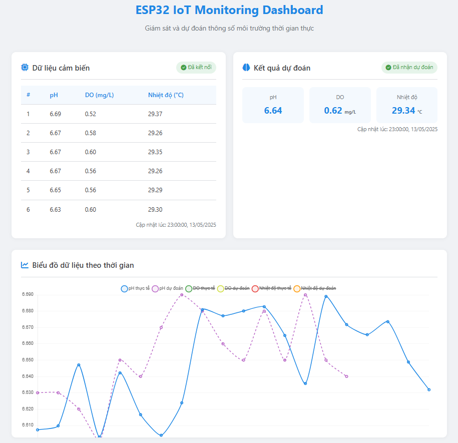

# Aquaponics System - IoT & AI Based Smart Agriculture

## 🌿 Mô hình hệ thống ngoài đời thực

  
  

## 📌 Giới thiệu

Dự án **Aquaponics System** nhằm xây dựng một mô hình kết hợp giữa **nông nghiệp thông minh (IoT)** và **trí tuệ nhân tạo (AI)** trong việc giám sát và điều khiển hệ sinh thái nuôi cá - trồng rau bền vững. 

Hệ thống được hiện thực bởi sinh viên Trường Đại học Bách Khoa TP.HCM, bao gồm:

- **ESP32-S3-Relay-6CH** thu thập dữ liệu từ cảm biến (pH, DO, Temperature)
- **CoreIOT** xử lý điều khiển thiết bị từ xa, lập lịch hoạt động, cảnh báo khi vượt ngưỡng
- **AI LSTM model** dự đoán sớm biến động môi trường để chủ động cảnh báo và bảo vệ hệ sinh thái

## 🧠 Tính năng nổi bật

- **Tự động thu thập dữ liệu** từ các cảm biến qua Modbus RTU RS485
- **Điều khiển thiết bị ngoại vi** (bơm, đèn, máy sục khí...) thủ công hoặc theo lịch trình
- **Gửi cảnh báo Telegram** khi thông số vượt ngưỡng
- **Cập nhật firmware từ xa (OTA)**
- **Hiển thị vị trí GPS** và cường độ tín hiệu Wi-Fi trên bản đồ
- **Ứng dụng AI LSTM** dự đoán pH, DO, Temperature trong 15 phút tới

## 🤖 AI Dự đoán & Cảnh báo sớm

Mô hình AI được huấn luyện với kiến trúc Conv1D + BiLSTM + Attention, dựa trên dữ liệu cảm biến lịch sử. Sau khi triển khai trên server Flask-SocketIO, luồng xử lý gồm:

1. ESP32 gửi dữ liệu mỗi 5s
2. Server thu thập và chuẩn hóa dữ liệu
3. Dự đoán 3 thông số môi trường
4. Gửi kết quả dự đoán về dashboard và ESP32
5. Cảnh báo nếu giá trị sắp vượt ngưỡng an toàn

### 📈 Ví dụ kết quả dự đoán

| Thông số | MAE   | RMSE  | R²     |
|----------|-------|-------|--------|
| pH       | 0.020 | 0.027 | 0.712  |
| DO       | 0.200 | 0.260 | -2.11  |
| Temp     | 0.041 | 0.054 | 0.987  |

## 🖥️ Giao diện Dashboard

- Giám sát dữ liệu theo thời gian thực
- Bảng cảnh báo trực quan
- Biểu đồ dự đoán AI
- Giao diện điều khiển thủ công / theo lịch
- Hiển thị GPS + RSSI trên bản đồ

## 🧰 Công nghệ sử dụng

- ESP32-S3 + Cảm biến RS485
- Flask + Socket.IO + Eventlet
- CoreIOT (ThingsBoard)
- Keras/TensorFlow + joblib
- HTML/CSS/JS Dashboard
- Telegram API
